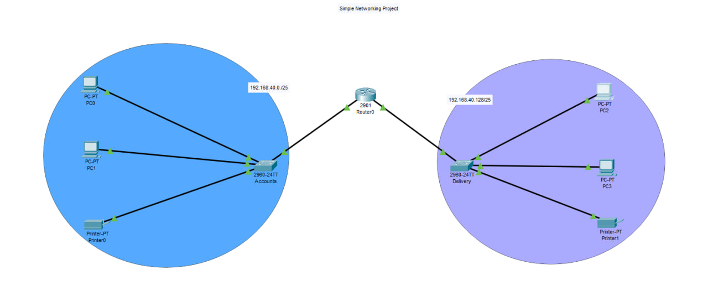

# dept-lan-design

A basic LAN design project created using Cisco Packet Tracer.  
This project demonstrates the connection of two departments — **Accounts** anddept-lan-desig— using subnetting and routers.

---

## 🛠️ Project Overview

- 🔌 Designed a local area network (LAN) connecting:
  - 📁* and **Delivery** — usin  - 🚚t-lan-design

A basic LAN- Each department includes at leastign project- Connected using:
  - Routers
  - Switches
  - Proper cabling
- All devices are configured with:
  - Static IP addresses
  - Subnet masks
  - Default gateways
- Network connectivity was verified usinguters.

tests between departments.

---

## 📡 Network Details

| Department  | Subnet             | Gateway IP        | Example PC IPs          |
|-------------|--------------------|-------------------|--------------------------|
| Accounts    | 192.168.40.0/25    | 192.168.40.1      | 192.168.40.10, .11       |
| Delivery    | 192.168.40.128/25  | 192.168.40.129    | 192.168.40.130, .131     |

---

## 🧰 Tools & Technologies

- Cisco Packet Tracer
- Subnetting (/25)
- Static IP configuration
- Basic Routing

---

## ✅ Results

- ✔️ Successful communication between all PCs across both departments
- ✔️ Clean, organized topology using appropriate addressing and design
- ✔️ Verified connectivity via
| Departests, example result from Delivery PC pinging Accounts PC:

Cisco Packet Tracer PC Command Line 1.0
C:>ping 192.168.40.10

Pinging 192.168.40.10 with 32 bytes of data:

Request timed out.
Reply from 192.168.40.10: bytes=32 time=9ms TTL=127
Reply from 192.168.40.10: bytes=32 time=12ms TTL=127
Reply from 192.168.40.10: bytes=32 time=1ms TTL=127

Ping statistics for 192.168.40.10:
Packets: Sent = 4, Received = 3, Lost = 1 (25% loss),
Approximate round trip times in milli-seconds:
Minimum = 1ms, Maximum = 12ms, Average = 7ms

C:>

- ✔️ Minor packet loss (25%) observed, likely due to simulation delay or network configuration fine-tuning

---

## 📁 Files Included

-

---

## 📡 Network De– Cisco Packet Tracer project file  
- project created– Network topology screenshot  
-esign project– Project documentation
